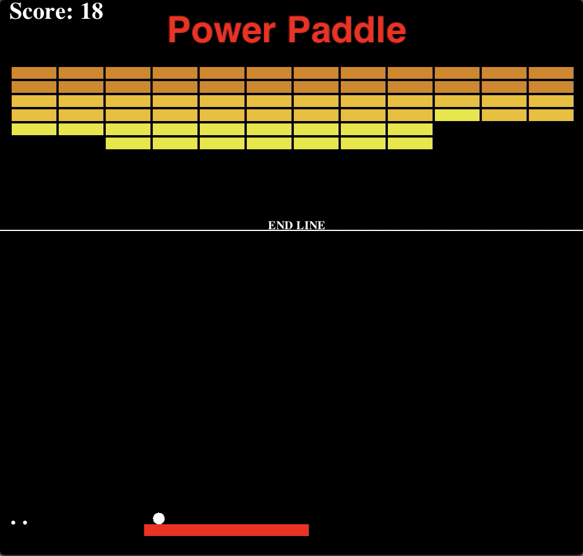
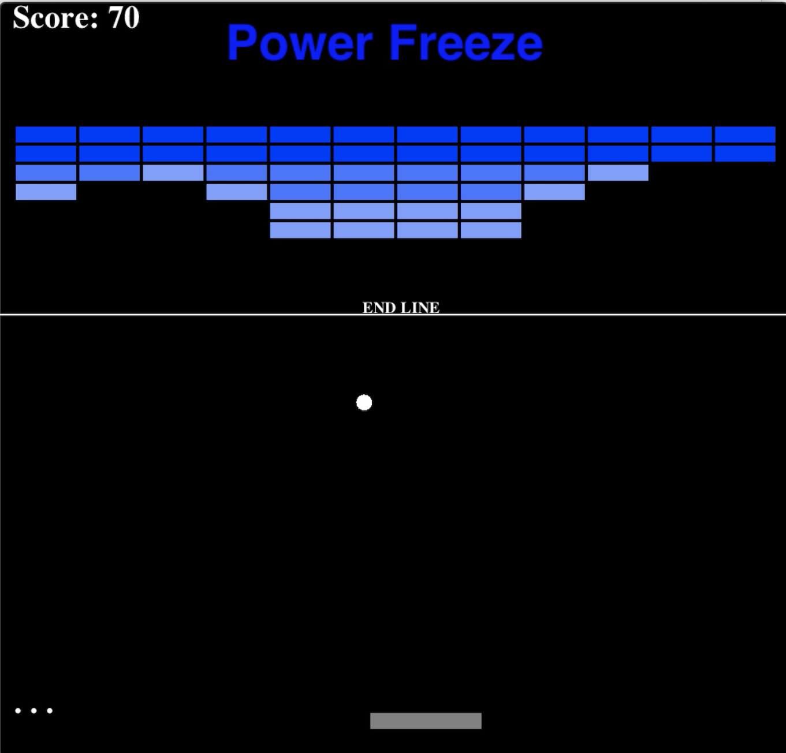
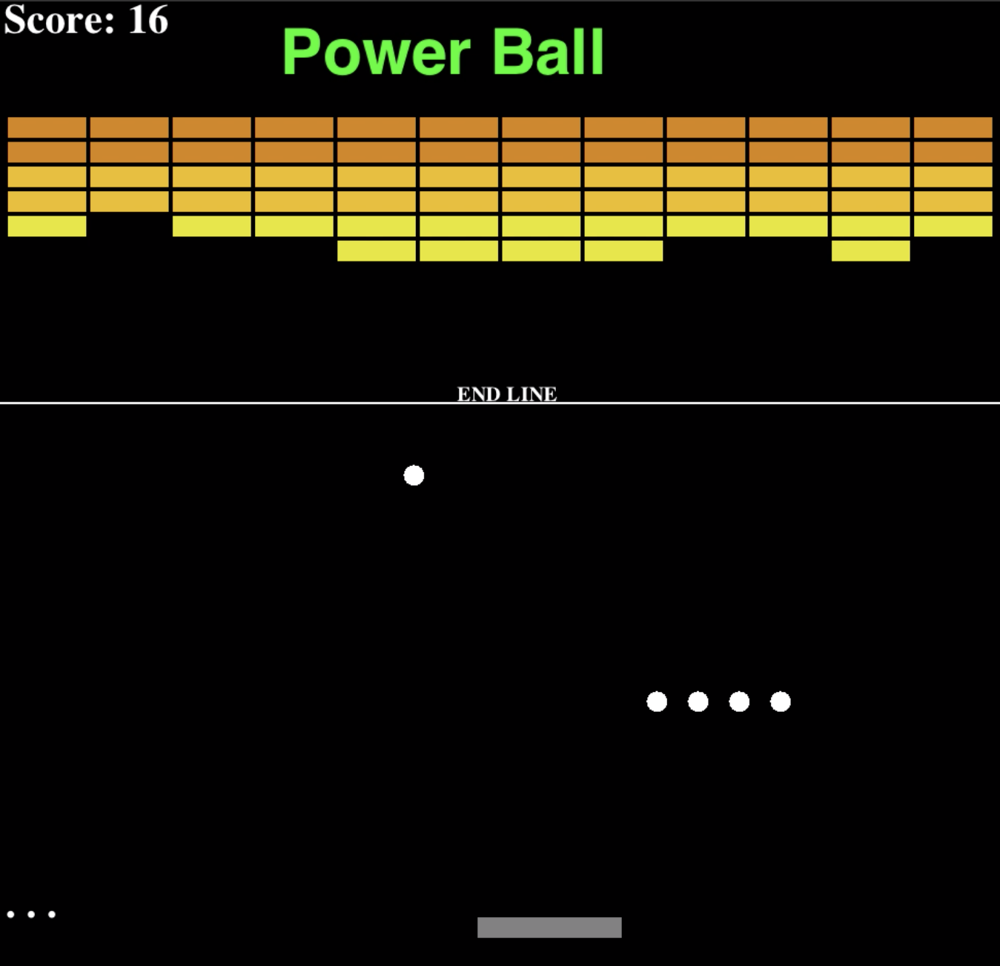

## Brick Breaker
Used Java to program a replica of brick breaker game with additional power features for final project of CIS 120 at UPenn
* Destroy the bricks with the ball
* Each brick hit is worth 2 points
* Move the paddle with left and right arrow keys to keep the ball from going off the screen or lese you will lose a life
* Power-Ups: 
	* Paddle Length Increase
	* Multiple Balls
	* Freeze Bricks
* Clear all the bricks and WIN
* You have 3 lives, lose them all and it's GAME OVER
* Brick touches the linke and it's GAME OVER

## Images

  
  
  

## CIS 120 Game Project README

### Core Concepts 

  #### List the core concepts, the features they implement, and why each feature is an appropriate use of the concept. Incorporate the feedback you got after submitting your proposal.

  #### 2D Array
  - There are 3 layers of bricks. Each layer of bricks is stored in a 2D array of Brick (which extends gameObj) that takes in x coordinate, y coordinate, velocity x, velocity y, width, height and a boolean that is true if it shows on the screen and false if it doesn’t show on the screen. It is an appropriate use of concept as the bricks are positioned in rows and columns.

  #### File I/O
  - I used I/O to implement high scores so i will store scores and associated full name in a txt file. The reader will read all the data (name and scores) there is and store it to an arrayList so that I can store the current data at a specific index in the arrayList according to its score (so arrayList will be sorted in descending order of scores). Then, I am getting the first 5 index of the arrayList to show the top 5 leader board. After that, the writer will write the arrayList into the txt file.

  #### Inheritance/Subtyping for Dynamic Dispatch
- I made a power class that takes in x coordinate, y coordinate, speed, width of the power, boolean that is true if the power if going down the screen and false otherwise, boolean that is true if power is activated and false otherwise, and a timer to keep track how long the power is activated, and a abstract  method powerImplementation. These powers have different advantages. I will have 3 types of power: make paddle longer, freeze the bricks (so the bricks will be moving down the screen slowly initially), and create multiple balls. So I will have a powerPaddle, powerFreeze, and powerBall class that extends power class and have different implementations of the powerImplementation method that implements what the power does. It is an appropriate use of concept as the powerFreeze, powerPaddle, and powerBall takes in the same argument but has different ways of implementing the powerImplementation. 
	
- Changes: I created a gameObj class that takes in x coordinate, y coordinate, velocity x, velocity y, width, height. Power class will extend gameObj and takes in extra argument powerDown, powerOn, timer, and a abstract method powerImplementation.
	
 #### Collections
- I used arrayList to store multiple balls when the power ball is activated. It is an appropriate use of concept as using arrayList allows me to easily add multiple balls when power ball is on and remove the ball if the ball goes out of the screen. At the start of the game, the arrayList will only have 1 ball so arrayList size is 1. If user gets the power ball, it adds 4 different ball to the arrayList.

### Your Implementation 

  #### Provide an overview of each of the classes in your code, and what their function is in the overall game.
  
  #### GameObj
  - Takes in x coordinate, y coordinate, velocity x, velocity y, width, height and contains abstract method move and method intersects to that returns a boolean if 2 objects collide.
	
  // Classes that extends GameObj
  #### Ball 
  - Bounces off bricks, paddle, left and right screen
  - Doesn't take extra argument. 
  
  #### Brick 
  - If hit by ball, brick disappears from screen and score increases
  - Takes in extra argument boolean showBrick that is true if it shows on the screen and false if it doesn't. 
  #### Paddle 
  - For the ball to not go below the screen and for catching powers
  - Takes in extra argument boolean padLeft that is true if left arrow key is pressed and false otherwise, boolean padRight that is true if right arrow key is pressed and false otherwise. 
  #### EndLine 
  - Player loses if the brick passes y position of the line: doesn't take extra argument. 
  #### Power
  - Takes in extra argument down, powerOn, time (explained further in Inheritance/Subtyping Dynamic Dispatch implementation). It also contains an abstract method powerImplementation, method showPowerName that shows the name of power activated for few seconds on the screen, method draw that draws a circle representing the power and method powerMove to have the power go down the screen.
		
//Classes that extends Power
  #### PowerFreeze 
  - freezes the brick from going down the screen
  - Doesn't take in extra argument but has extra private variables: brickUpdate that is set to 0 if power is activated and 3 if power is not activated, and brick1Color, brick2Color, brick3Color that sets the colors to shades of blue if power is activated and to shades of yellow if power is not activated.
  #### PowerPaddle 
  - increases length of paddle
  - Takes in extra argument paddleLength that is set to 140 if power is activated and 70 if power is not activated
  #### PowerBall 
  - Creates multiple ball
  - Doesn't take in extra argument. If power activated, shows the power name on screen. Handling of multiple ball is done in brick board
			
		
#### Were there any significant stumbling blocks while you were implementing your game (related to your design, or otherwise)?
  * It was hard to keep track all the variables and methods that were in my game as a lot of changes has been made. Commenting on what certain parts of my code does helps with remembering what I did before. 
  * When I run into an error, it was hard to tell where the error is coming from. I traced my error by having print statements on the variables.
  * I first implemented an intersection method at the brick board class and had to write similar code multiple times to account for an object colliding with multiple object but realized I could write it at gameObj class instead.
  * I didn't have power class extend gameObj initially and realized sometime after implementing my 2 power ups that I could just extend gameObj as it has the same parameters with few extra argument. So i had to rewrite a few things.
  
 

#### Evaluate your design. Is there a good separation of functionality? How well is private state encapsulated? What would you refactor, if given the chance?
  * I believe having brick, paddle, ball, power extend GameObj is a good design as it takes in similar values and having intersection method in GameObj prevents user from accessing the details if an object intersects another object. The powerImplementation is also well encapsulated as what the power does is being handled in it's own class. 

